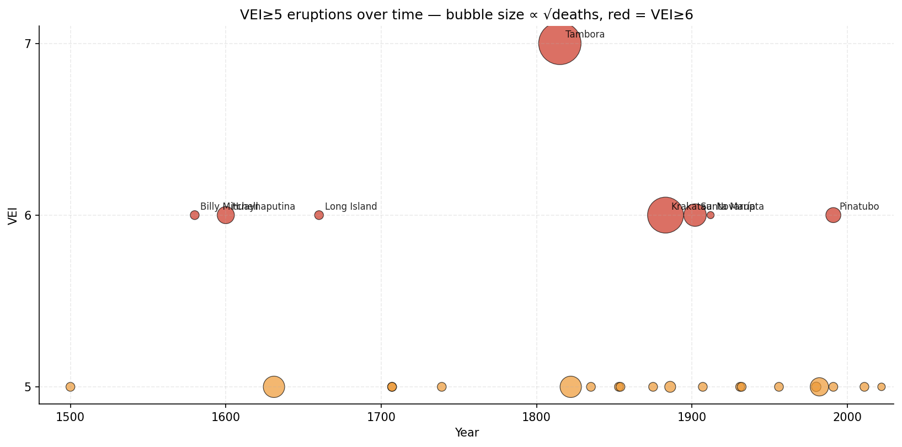
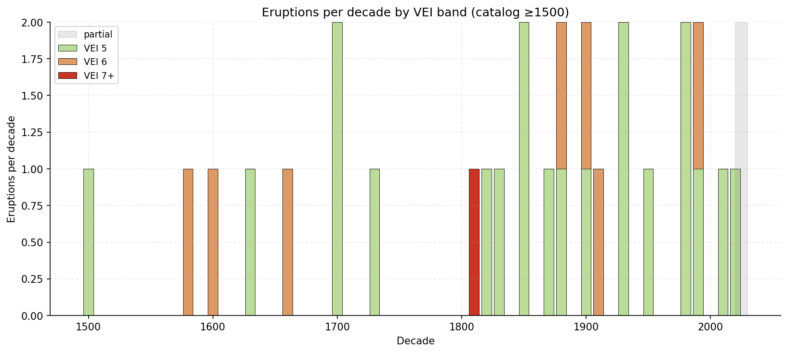
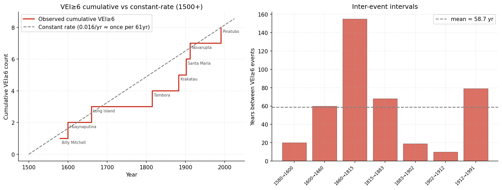
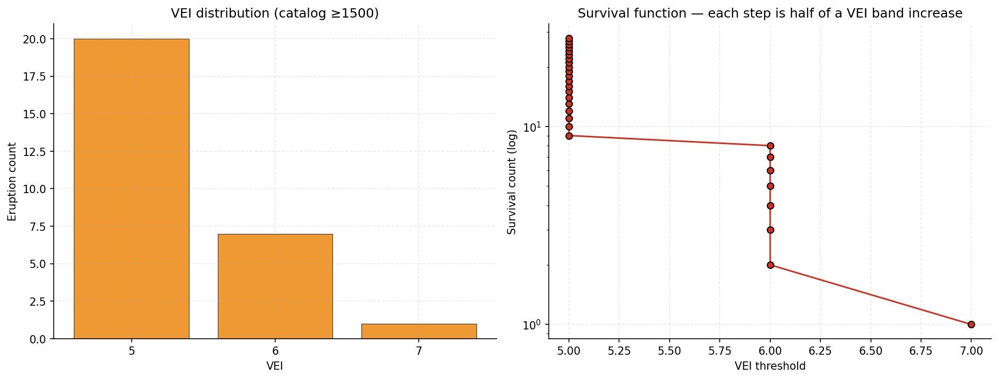

# volcanic-eruptions

Hand-curated catalog of VEI ≥ 5 volcanic eruptions since 1500 CE, plus a handful of notable VEI 4 events with major societal impact (Pelée, Eyjafjallajökull).

One of 10 sibling repos analyzed together — see the [`correlations`](https://github.com/Biblejustin/correlations) hub for the cross-repo analysis.

## Quick findings

- **28 VEI≥5 eruptions since 1500**; **8 VEI≥6** and **1 VEI≥7** (1815 Tambora).
- **Mean inter-VEI≥6 interval = 58.7 years** (~once per long generation). The 155-year gap 1660 → 1815 is the longest in the catalog; the 1815–1991 stretch had 5 VEI≥6 events at ~35-year cadence.
- **Tambora 1815** is the only VEI 7 in recorded history — caused the global "Year Without Summer" of 1816 and contributed to several famines.
- **VEI≥5 occurs on average every ~20 years** in the modern era, but with strong clustering (1980 St Helens, 1982 El Chichón, 1991 Pinatubo, 1991 Cerro Hudson, then a quiet 2000s–2010s, then 2022 Hunga Tonga).
- **Post-1900 decadal trend = +0.002 eruptions/decade [95% CI +0.000, +0.003]** — essentially zero. Consistent with the geophysical expectation that eruption rates are steady-state on this timescale.
- **Most VEI≥5 eruptions have low death tolls** (single-digit thousands or less); the high-fatality outliers (Krakatau, Tambora, Pelée) killed mostly via tsunamis or pyroclastic flows reaching coastal populations.

## Sample output

### VEI timeline

VEI vs year scatter. Bubble size ∝ √deaths; red = VEI≥6. Big names (Tambora, Krakatau, Pinatubo, etc.) are annotated. The 18th century gap and the late-1980s-to-90s cluster are both visible.

**In plain English:** Each circle is one eruption. The y-axis is "VEI" — the Volcanic Explosivity Index, a scale from 0 (small lava flow) to 8 (super-eruption). It works like the Richter scale for earthquakes — each step up is roughly 10× more powerful. Most circles cluster at VEI 5; the bigger ones (red dots) are once-a-century events. Tambora 1815 at VEI 7 is the only one of its kind in the entire 500-year record.



### Eruptions per decade by VEI band

Stacked bars per decade (catalog starts 1500), with a dashed OLS trend line and bootstrap 95% CI. Trend is tiny and barely above zero — mostly an artifact of better detection of remote 19th-century eruptions vs 16th–17th-century ones. Genuinely flat over the past century.

**In plain English:** Each bar shows how many large eruptions happened in that 10-year window. The dashed line is the trend through them all. The "bootstrap CI" is a way of asking "how confident are we in this trend?" — we recalculated the trend 2,000 times on slight reshuffles of the data and the answers were all small numbers very close to zero. So the catalog shows essentially no change over centuries in how often the planet produces large eruptions. The slight upward look is just because explorers in the 1800s found and recorded eruptions in remote places that the 1600s would have missed.

**Above vs. below the line:** Decades whose bars rise *above* the dashed trend line had more catalogued VEI≥5 eruptions than the long-run average; *below* means fewer. The 1880s and 1990s have noticeably above-trend bars (Krakatau 1883; Pinatubo + Cerro Hudson 1991 plus several others). The 1700s and 1960s sit below the line — quieter stretches. Because the slope is essentially zero, "above vs below" mostly just tells you which centuries happened to have a clustering of big eruptions and which didn't.



### Great eruption timing (VEI≥6)

Cumulative VEI≥6 count vs constant-rate reference + inter-event interval bar chart. The 155-year gap 1660→1815 stands out; the 1815–1991 stretch was unusually dense by recorded-history standards.

**In plain English:** Left panel: the grey line is what you'd see if super-eruptions happened on a steady clock (roughly once every 60 years). The red staircase shows when they actually happened. **Above vs. below the line:** when the red staircase is *above* the grey reference, VEI≥6 eruptions have been arriving *faster* than the long-run rate; *below* the line means they've been arriving *slower*. The catalog spent the entire 1660–1815 stretch *below* the line (the long quiet — 155 years with no VEI≥6) and then crossed above during 1815–1991 when five super-eruptions occurred in 176 years. Right panel: how many years passed between each VEI≥6 eruption and the next one. The 155-year gap between 1660 and 1815 (Tambora) is the longest in the record; the 1800s and 1900s were unusually busy.



### VEI distribution

VEI histogram + semi-log survival curve. Each step up in VEI corresponds roughly to a 10× decrease in count, matching the canonical Gutenberg-Richter analog for explosive volcanism.

**In plain English:** Left panel: simple count — how many eruptions of each VEI rating happened. Right panel: same data but shown as a curve dropping steeply on a log scale. Each step up in VEI cuts the number of events by roughly a factor of 10. This is the same pattern earthquakes follow: small events common, big events rare, and the rate follows a predictable formula.



## What's in it

`volcanoes.csv` — columns:

- `year`, `month` — eruption start
- `name` — primary volcano name
- `country_region`
- `vei` — Volcanic Explosivity Index. **5 is the detection-clean band globally back to 1500**; VEI 4 is included sparingly for notable high-impact events
- `deaths_estimate` — published estimates (often dominated by tsunamis or lahars, not the eruption itself)
- `sources_notes`

Coverage: 1500 → 2022 (Hunga Tonga). Major events include:

- 1600 Huaynaputina (largest South American)
- 1815 Tambora (largest in recorded history, VEI 7, "Year Without Summer" 1816)
- 1883 Krakatau (VEI 6, ~36k deaths via tsunami)
- 1902 Pelée (29k deaths despite "only" VEI 4)
- 1912 Novarupta (largest 20th C)
- 1980 Mt St Helens
- 1991 Pinatubo (~0.5°C global cooling)
- 2022 Hunga Tonga (largest atmospheric blast since 1883)

## Detection-bias notes

| Band | Coverage |
|---|---|
| VEI ≥ 7 | Detection-clean for several millennia (each event leaves a global tephra layer) |
| VEI ≥ 6 | Detection-clean back to ~1500 globally |
| VEI ≥ 5 | Detection-clean back to ~1500 for populated regions; remote events (Aleutians, Kamchatka, Southern Andes) may be undercounted pre-1850 |
| VEI ≤ 4 | Heavy completeness gaps pre-1900; only included if high-impact |

For the correlations work, use VEI ≥ 5 as the M ≥ 7-analog band.

## Reproducing the plots

```bash
python3 -m venv .venv
.venv/bin/pip install pandas numpy matplotlib
.venv/bin/python make_plots.py
```

## Source

Primary: Smithsonian Institution Global Volcanism Program — https://volcano.si.edu/

Death-toll estimates from:
- Tanguy, J.-C. et al. (1998). *Victims from volcanic eruptions: a revised database.* Bull Volcanol.
- Witham, C. S. (2005). *Volcanic disasters and incidents.* J Volc Geo Res.

## Intended use

Data source for the volcano correlation tests in [`Biblejustin/correlations`](https://github.com/Biblejustin/correlations). Expected non-null result: volcanic eruptions × earthquakes (subduction-zone coupling is real physics, though at much shorter timescales than yearly counts).
